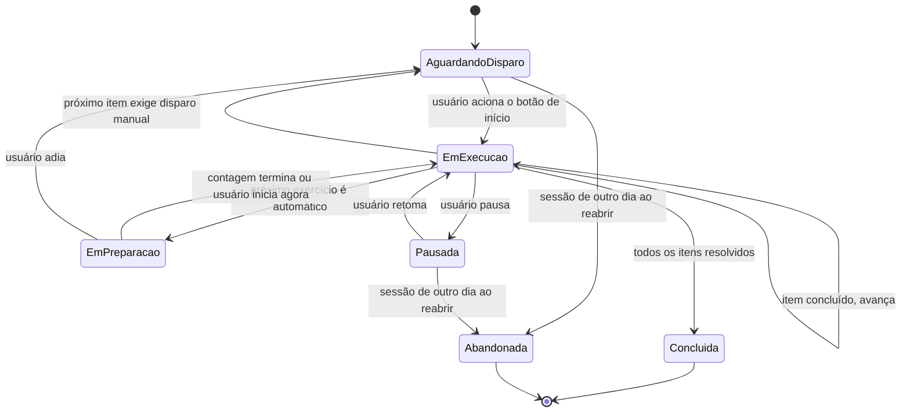

# Phase 1 — Modelo de Dados

**Feature**: 001 — App de Acompanhamento de Treino de Fisioterapia
**Data**: 2026-09-09
**Base**: [spec.md](./spec.md) (Key Entities + Clarifications) e [research.md](./research.md)

O modelo tem duas camadas com propósitos distintos:

- **Camada de prescrição** — Treino, Série, Exercício, Etapa. É o que o usuário cadastra e edita.
  Muda raramente.
- **Camada de execução** — Sessão e Item de Execução. É gerada a partir da prescrição no momento
  de iniciar um treino e muda a cada segundo. Nunca altera a prescrição.

A separação existe porque os checks pertencem à sessão, não ao treino (clarificação Q2): executar
o mesmo treino três vezes no dia produz três sessões independentes sobre a mesma prescrição.

---

## Camada de prescrição

### Treino

| Campo | Tipo | Regras |
|---|---|---|
| `id` | identificador | gerado pelo sistema |
| `nome` | texto | obrigatório, 1 a 80 caracteres |
| `diasDaSemana` | conjunto de dias | ao menos um dia quando houver horários |
| `horarios` | lista de horas do dia | zero ou mais; sem duplicatas |
| `itens` | lista ordenada | cada item é uma Série ou um Exercício |
| `criadoEm`, `atualizadoEm` | instante | mantidos pelo sistema |

**Regras de validação**

- Um treino sem nenhum item pode ser salvo como rascunho, mas MUST NOT ser iniciado (FR-001).
- A ordem dos itens é explícita e contígua; reordenar reescreve as posições (FR-006).
- Um treino aceita Séries, Exercícios diretos ou a mistura dos dois (FR-002).

### Série

| Campo | Tipo | Regras |
|---|---|---|
| `id` | identificador | gerado pelo sistema |
| `treinoId` | referência | obrigatório |
| `ordem` | inteiro | posição dentro do treino |
| `nome` | texto | opcional (ex.: "Série única") |
| `quantidadeDeSeries` | inteiro | ≥ 1; padrão 1 |
| `descansoEntreSeriesSegundos` | inteiro | ≥ 0; obrigatório quando `quantidadeDeSeries` > 1 |
| `exercicios` | lista ordenada | ao menos um exercício para poder ser executada |

**Regras de validação**

- O descanso é aplicado **entre** repetições do grupo e **não** após a última (FR-003a).
- Com `quantidadeDeSeries` igual a 1, o descanso é ignorado na expansão.

### Exercício

| Campo | Tipo | Regras |
|---|---|---|
| `id` | identificador | gerado pelo sistema |
| `paiId` | referência | um Treino ou uma Série |
| `ordem` | inteiro | posição dentro do pai |
| `nome` | texto | obrigatório, 1 a 80 caracteres |
| `livre` | booleano | padrão `false` |
| `repeticoes` | inteiro | ≥ 1 quando não livre; ausente quando livre |
| `modoDisparo` | `manual` \| `automatico` | padrão `manual` (FR-008) |
| `tempoPreparacaoSegundos` | inteiro | > 0 obrigatório quando `automatico`; ausente quando `manual` |
| `etapas` | lista ordenada | ao menos uma etapa quando não livre |

**Regras de validação**

- `livre = true` dispensa `repeticoes` e tempos de etapa (FR-005).
- `modoDisparo = automatico` sem `tempoPreparacaoSegundos > 0` MUST impedir o salvamento
  (FR-010).
- O primeiro exercício executável de um treino é sempre disparado manualmente, mesmo que esteja
  configurado como automático: não existe item anterior para encadear.

### Etapa

| Campo | Tipo | Regras |
|---|---|---|
| `id` | identificador | gerado pelo sistema |
| `exercicioId` | referência | obrigatório |
| `ordem` | inteiro | posição dentro do exercício |
| `descricao` | texto | obrigatório, 1 a 120 caracteres |
| `tempoExecucaoSegundos` | inteiro | > 0 quando o exercício não é livre |

---

## Camada de execução

### Sessão de Execução

| Campo | Tipo | Regras |
|---|---|---|
| `id` | identificador | gerado pelo sistema |
| `treinoId` | referência | obrigatório |
| `dataLocal` | data | dia em que a sessão começou; base da regra de retomada |
| `iniciadaEm` | instante | obrigatório |
| `finalizadaEm` | instante | preenchido ao concluir ou abandonar |
| `estado` | ver máquina abaixo | |
| `indiceAtual` | inteiro | posição na sequência de itens |
| `itens` | lista ordenada | a sequência achatada, materializada no início |

**Regras de validação**

- A sessão é criada com uma cópia expandida da prescrição. Editar o treino depois **não** altera
  sessões existentes: o histórico da execução permanece fiel ao que foi executado.
- Só pode existir uma sessão em andamento por treino. Ao abrir o treino:
  - se houver sessão em andamento **do mesmo `dataLocal`**, o app oferece retomar ou recomeçar
    (FR-025a);
  - se a sessão em andamento for de outro dia, ela é encerrada como abandonada e uma nova sessão
    zerada é criada (FR-025b).

### Item de Execução

É a unidade que a timeline exibe e que o motor executa. Gerado pela expansão descrita adiante.

| Campo | Tipo | Regras |
|---|---|---|
| `indice` | inteiro | posição na sequência, contígua a partir de 0 |
| `tipo` | `preparacao` \| `etapa` \| `descanso` \| `exercicioLivre` | |
| `duracaoPlanejadaSegundos` | inteiro ou ausente | ausente para `exercicioLivre` (FR-017) |
| `estado` | `pendente` \| `emExecucao` \| `concluido` \| `pulado` | padrão `pendente` |
| `iniciadoEm` | instante | preenchido ao entrar em execução |
| `resolvidoEm` | instante | preenchido ao concluir ou pular |
| `exigeDisparoManual` | booleano | verdadeiro no primeiro item de um exercício manual |
| `origem` | referências | `serieId`, `repeticaoDaSerie`, `exercicioId`, `repeticaoDoExercicio`, `etapaId` |
| `rotulo` | texto | descrição exibida na timeline |

O campo `origem` é o que permite à timeline agrupar visualmente os itens por série e exercício
(FR-014) sem que o motor precise navegar a árvore da prescrição.

---

## Expansão da prescrição em sequência

Regra determinística aplicada ao iniciar uma sessão. É o núcleo do plano, porque dela dependem a
timeline, o progresso e o tempo restante.

Para cada item do treino, em ordem:

- **Se for Série**: para `r` de 1 até `quantidadeDeSeries`:
  - expandir todos os exercícios da série;
  - se `r` < `quantidadeDeSeries`, emitir um item `descanso` com
    `descansoEntreSeriesSegundos`.
- **Se for Exercício**: expandir o exercício.

Expansão de um exercício:

- se `modoDisparo = automatico` **e** existir item anterior na sequência, emitir um item
  `preparacao` com `tempoPreparacaoSegundos`;
- se `livre = true`, emitir um único item `exercicioLivre`, sem duração;
- caso contrário, para `n` de 1 até `repeticoes`, emitir um item `etapa` para cada etapa do
  exercício, na ordem, com sua `tempoExecucaoSegundos`;
- marcar `exigeDisparoManual = true` no primeiro item emitido quando `modoDisparo = manual`.

**Exemplo do material de origem** — série única, "Contrair" com 8 repetições de duas etapas (7s e
4s) e "Contrai/Relaxa" com 10 repetições de duas etapas (2s e 2s), ambos manuais:
16 itens do primeiro exercício + 20 do segundo = **36 itens**, totalizando
`8 × 11s + 10 × 4s = 128s` de tempo planejado, com dois pontos de disparo manual.

---

## Máquina de estados da sessão

**Transições com regra própria**

- `EmPreparacao → AguardandoDisparo` (adiar): cancela a contagem e passa a exigir o botão apenas
  nesta sessão, sem alterar `modoDisparo` da prescrição (FR-012a).
- `AguardandoDisparo`: o relógio da sessão fica parado e o tempo de espera **não** entra no tempo
  restante estimado (FR-031).
- `EmExecucao` após retorno do background: recalcula por tempo absoluto e pode resolver vários
  itens de uma vez (D2), parando no primeiro item que exigir disparo manual.

---

## Cálculo de progresso

Com a sequência achatada, ambos os indicadores são somas simples — o que torna o cálculo testável
sem renderizar tela.

- **Denominador**: itens com estado diferente de `pulado`. Itens pulados saem do total (FR-030a).
- **Porcentagem concluída**: `concluídos ÷ (total − pulados)`, em contagem de itens.
- **Tempo restante estimado**: soma de `duracaoPlanejadaSegundos` dos itens `pendente`, mais o
  tempo remanescente do item `emExecucao`. Itens `exercicioLivre` não somam tempo; quando existe
  ao menos um deles pendente, o valor é apresentado como estimativa.
- **Exclusões**: tempo de espera por disparo manual e tempo de pausa nunca entram no tempo
  restante (FR-031).
- **Conclusão da sessão**: todos os itens em `concluido` ou `pulado`, com ao menos um
  `concluido`; a tela final informa quantos foram pulados (FR-032).

---

## Lembrete

Não é uma tabela própria: deriva do par `diasDaSemana × horarios` do Treino. O que persiste é o
vínculo entre essa combinação e o identificador da notificação agendada no sistema operacional,
para permitir cancelar e reagendar quando o treino for editado (FR-033).

| Campo | Tipo | Regras |
|---|---|---|
| `treinoId` | referência | obrigatório |
| `diaDaSemana` | dia | obrigatório |
| `horario` | hora do dia | obrigatório |
| `identificadorNotificacao` | texto | devolvido pelo sistema operacional ao agendar |

Falha de agendamento é registrada e exibida como aviso, sem bloquear a execução do treino.
